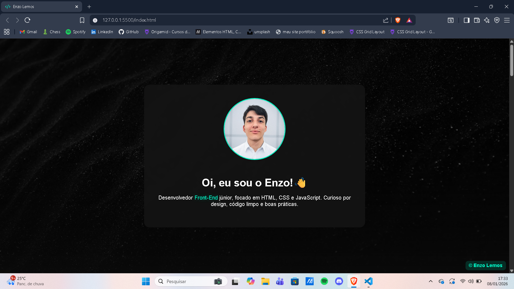
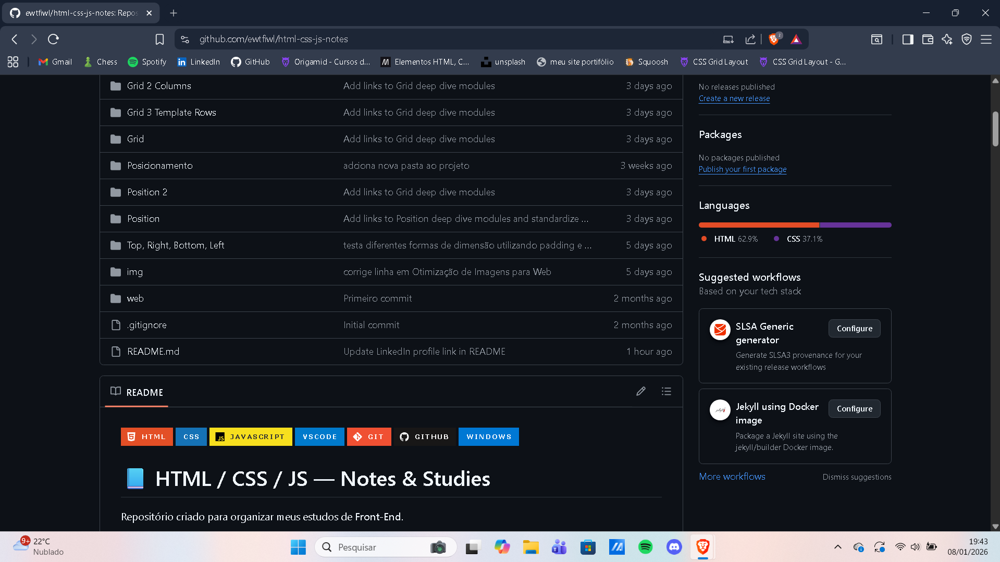

# 👋 Olá! Eu sou o Enzo Lemos

🎓 Último semestre de Análise e Desenvolvimento de Sistemas (UNIP) | 💻 Foco em Back-End  
📍 São Paulo - SP | 🔍 Buscando oportunidade como **Estagiário ou Desenvolvedor Júnior**

---

### 🌟 Sobre mim

Sou curioso, comunicativo e adoro **resolver problemas e criar soluções visuais**.  
Estou em fase de transição para a área de tecnologia: estudando, errando, ajustando e evoluindo todo dia.

> “Aprender fazendo” é meu lema: cada projeto é uma chance de evoluir e mostrar resultado.

---

### 🔥 Tecnologias & Ferramentas

---

### 📂 Projetos em Destaque

  

  <strong>🌐 Meu Site</strong> — Site pessoal responsivo com HTML/CSS, layout moderno e animações suaves

  

  <strong>📚 HTML/CSS/JS Notes</strong> — Anotações completas de Front-End, exercícios e mini projetos

  

  <strong>🎨 Projetos Visuais</strong> — Experimentos com cores, layouts e responsividade

---

### 💡 Skills em prática

  
  
  
  
  

- **Front-End:** HTML, CSS, JavaScript, Flexbox, Grid, Responsividade
- **Back-End & DB:** Python, SQL (MySQL/PostgreSQL)
- **Controle de versão:** Git & GitHub
- **Conceitos:** Lógica de programação, POO, estruturas de dados

---

### 🌐 Contato & Networking

  
  
   
  📫 <strong>Email:</strong> enzo.lemos05@gmail.com

---

💬 Sempre aberto para **trocar ideias, colaborar em projetos e aprender**.  
Vamos construir coisas incríveis juntos! 🚀

---
