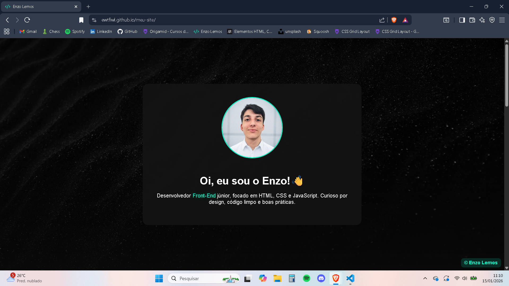
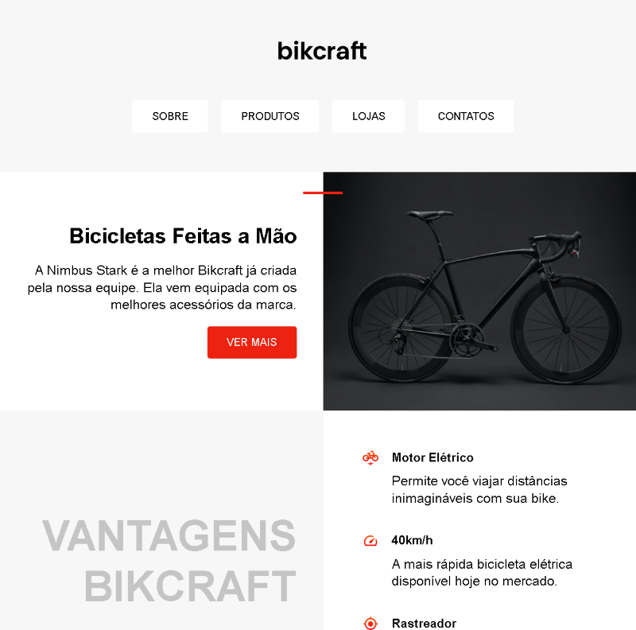

# 👋 Olá, eu sou o Enzo Lemos

🙇🏻‍♂️ Curioso, comunicativo e apaixonado por criar soluções visuais e acessíveis.  
Aprendo testando, errando e refinando projetos todos os dias.

> “Aprender fazendo” é meu lema: cada projeto é uma chance de evoluir e mostrar resultado.

---

## 🛠️ Minhas Skills

  
  
  
  
  
  

- **Front-End:** HTML, CSS, JavaScript
- **Layout & Responsividade:** Flexbox, Grid, Media Queries
- **Boas práticas:** Semântica, Acessibilidade, Performance
- **Controle de versão:** Git & GitHub

---

## ⏭️ Projetos em Destaque

  
   
  🌐 Site Pessoal — Portfólio moderno, responsivo, com animações suaves e HTML semântico.
   
  🔗 <a href="https://github.com/ewtfiwl/meu-site/">Repo</a> | 🌍 <a href="https://ewtfiwl.github.io/meu-site/">Demo</a>

  
   
  🚴 Bikcraft — Landing page de loja de bicicletas artesanais, HTML/CSS com Grid layout.
   
  🔗 <a href="https://github.com/ewtfiwl/Bikcraft">Repo</a> | 🌍 <a href="https://ewtfiwl.github.io/Bikcraft/">Demo</a>

  
   
  📓 HTML/CSS/JS Notes — Anotações completas de Front-End, exercícios e mini projetos.
   
  🔗 <a href="https://github.com/ewtfiwl/html-css-js-notes">Repo</a>

---

## 📩 Contato

---

💬 Sempre aberto para **trocar ideias, colaborar em projetos e aprender**.  
Vamos construir coisas incríveis juntos! 🚀
